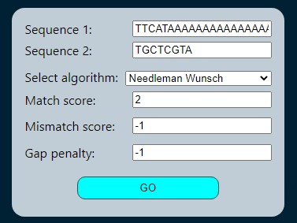
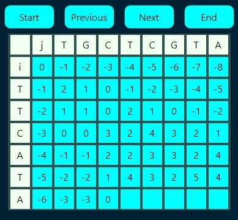
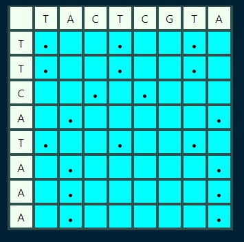
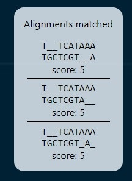
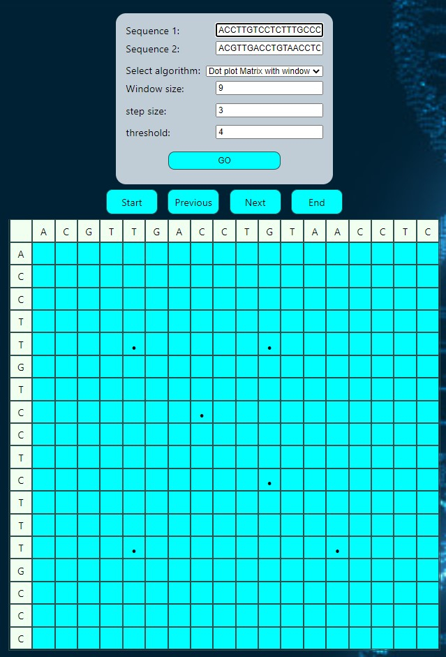
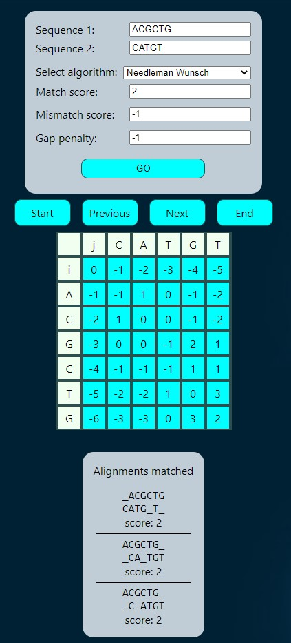
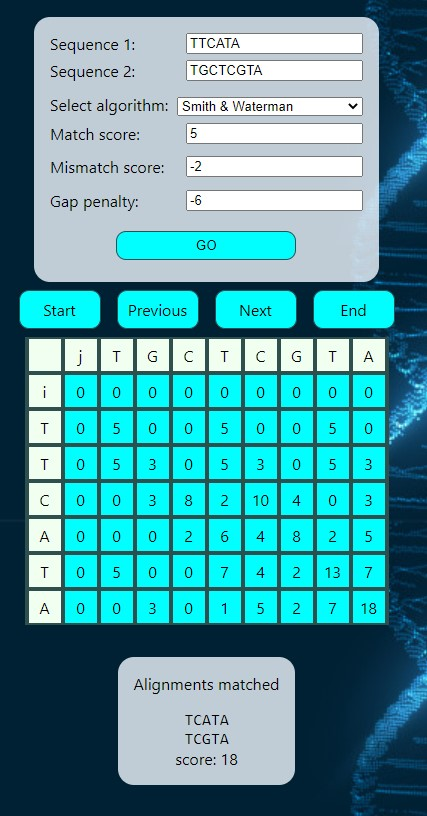
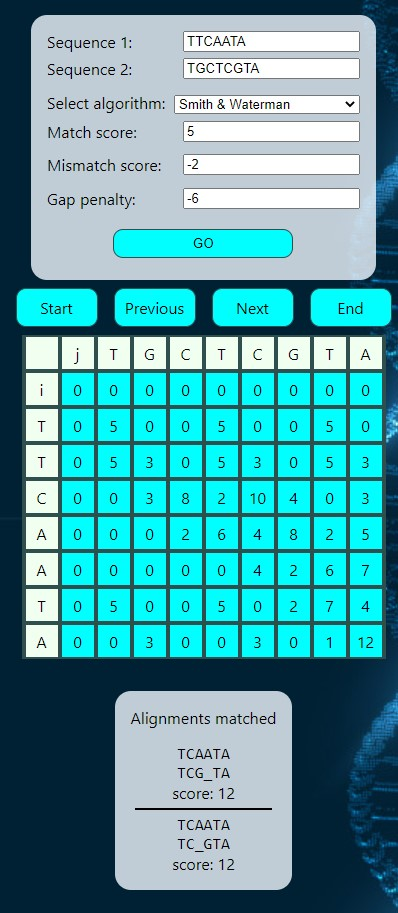

# BioInformatics Algorithms Implementation and visualizatoin

deployed live [here](https://bit.ly/3fklUMva)

## Built with

-   React
-   Heroku

## Implemented Algorithms

-   Needleman Wunsch
-   Smith &amp; Waterman
-   Dot plot Matrix
-   Dot plot Matrix with window
-   Maximum Score Matrix

The alignment and alignment score are displayed for the following algorithms

-   Needleman Wunsch
-   Smith &amp; Waterman

# screenshots

## Inputs

## Needleman Wunsch, steps navigation

## Dot Plot Matrix

## Alignments found

## Test cases and Examples

### Dot plot matrix with window

### Needleman Wunsch

### Smith Waterman

### Example with multiple alignments

